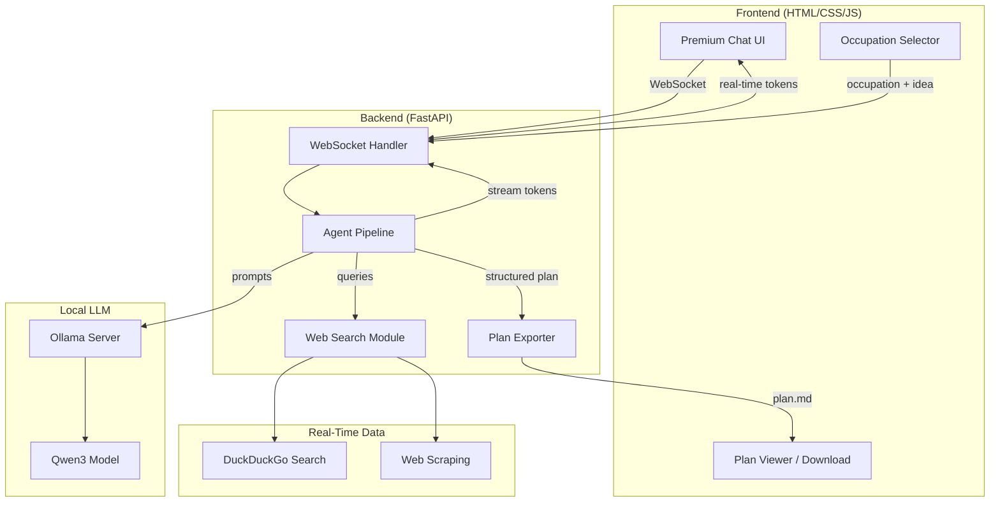
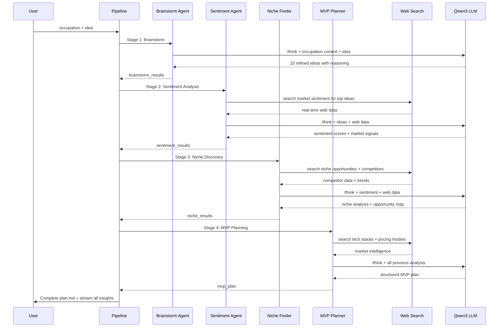
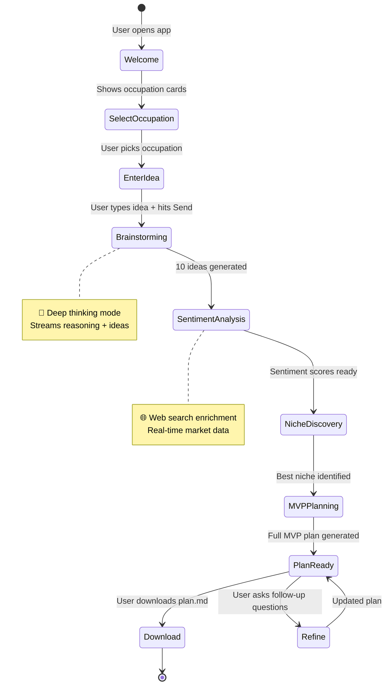

# 🧠 PRODUCT THINKER — Implementation Plan

> **AI-Powered Product Ideation & Market Intelligence System**
> Local LLM (Ollama Qwen3) · Real-Time Web Data · Occupation-Based Recommendations

---

## Vision

**PRODUCT THINKER** is a real-time AI chatbot that acts as a senior product strategist. Given a user's **occupation** and **rough idea**, it orchestrates a multi-stage thinking pipeline:

```
Occupation → Brainstorm → Sentiment Analysis → Niche Discovery → Market Opportunity → MVP Plan
```

Each stage uses Qwen3's **deep thinking mode** (`/think`) to produce reasoning traces, and enriches analysis with **live web data** via DuckDuckGo search. The final output is a downloadable `plan.md` containing a structured, actionable MVP blueprint.

---

## Architecture Overview



---

## User Review Required

> [!IMPORTANT]
> **Ollama + Qwen3 Prerequisite**: You must have Ollama installed and the Qwen3 model pulled before running this project. We'll use `qwen3:8b` (needs ~5GB VRAM/RAM). If your machine can handle it, `qwen3:14b` or `qwen3:30b` will produce significantly better analysis.

> [!WARNING]
> **Real-Time Web Data**: We'll use the free `duckduckgo-search` Python library for web data (no API key needed). This is rate-limited for heavy usage. For production scaling, consider Tavily or SerpApi (requires API keys stored in `.env`).

> [!IMPORTANT]
> **No External API Keys Required for MVP**: The entire system runs locally — Ollama for LLM, DuckDuckGo for web search. Zero cost, full privacy.

---

## Open Questions

> [!IMPORTANT]
> **Q1: Qwen3 Model Size** — Which Qwen3 variant should we target?
> - `qwen3:8b` (~5GB) — Good for most machines, decent reasoning
> - `qwen3:14b` (~9GB) — Better analysis, needs more RAM
> - `qwen3:30b` (~19GB) — Best quality, needs beefy GPU
>
> **Default: `qwen3:8b`** — We'll make this configurable via `.env`

> [!IMPORTANT]
> **Q2: Occupation List** — Should we use a predefined list of occupations (dropdown) or let users type freely? I recommend a **hybrid approach**: curated dropdown with a "Custom" option for free text. Here's the proposed default set:
> - Software Developer / Engineer
> - Designer (UI/UX / Graphic)
> - Marketing / Growth
> - Finance / Accounting
> - Healthcare Professional
> - Educator / Teacher
> - Content Creator / Writer
> - E-Commerce / Retail
> - Freelancer / Consultant
> - Student / Researcher
> - Other (Free Text)

> [!NOTE]
> **Q3: Plan Export Format** — The plan will be generated as `plan.md` (Markdown). Should we also support PDF export? (Can add later as enhancement)

---

## Proposed Changes

### Technology Stack

| Layer | Technology | Why |
|:------|:-----------|:----|
| **Frontend** | HTML + Vanilla CSS + JavaScript | Per user rules — simple, no framework overhead |
| **Backend** | FastAPI + WebSocket | Async streaming, lightweight, excellent for real-time chat |
| **LLM** | Ollama + Qwen3 | Local, free, deep thinking mode support |
| **Web Search** | `duckduckgo-search` | Free, no API key, sufficient for MVP |
| **Web Scraping** | `httpx` + `beautifulsoup4` | Extract content from search results |
| **Export** | Built-in Markdown generation | Direct plan.md creation |

---

### Project Structure

```
PRODUCT-THINKER/
├── .env                          # Configuration (model name, ports)
├── requirements.txt              # Python dependencies
├── README.md                     # Project documentation
│
├── backend/
│   ├── main.py                   # FastAPI app entry point + WebSocket
│   ├── config.py                 # Environment config loader
│   ├── agents/
│   │   ├── __init__.py
│   │   ├── pipeline.py           # Main agent orchestrator
│   │   ├── brainstorm.py         # Brainstorming agent
│   │   ├── sentiment.py          # Sentiment analysis agent
│   │   ├── niche_finder.py       # Niche & market opportunity agent
│   │   └── mvp_planner.py        # MVP plan generator
│   ├── services/
│   │   ├── __init__.py
│   │   ├── llm_service.py        # Ollama/Qwen3 communication
│   │   ├── web_search.py         # DuckDuckGo search integration
│   │   └── plan_exporter.py      # Markdown plan file generator
│   └── prompts/
│       ├── __init__.py
│       ├── system_prompts.py     # Occupation-aware system prompts
│       └── stage_prompts.py      # Stage-specific prompt templates
│
├── frontend/
│   ├── index.html                # Main chat interface
│   ├── css/
│   │   └── styles.css            # Premium design system
│   └── js/
│       ├── app.js                # Main application logic
│       ├── chat.js               # WebSocket chat handler
│       ├── occupation.js         # Occupation selector logic
│       └── plan-viewer.js        # Plan display & download
│
└── tests/
    ├── test_llm_service.py       # LLM service tests
    ├── test_web_search.py        # Web search tests
    ├── test_brainstorm.py        # Brainstorm agent tests
    ├── test_sentiment.py         # Sentiment agent tests
    ├── test_niche_finder.py      # Niche finder tests
    ├── test_mvp_planner.py       # MVP planner tests
    └── test_pipeline.py          # Pipeline integration tests
```

---

### Component Details

---

#### Backend — Core Services

##### [NEW] [.env](file:///c:/Users/ACER/OneDrive/Desktop/PROJECT/.env)
```env
# LLM Configuration
OLLAMA_BASE_URL=http://localhost:11434
OLLAMA_MODEL=qwen3:8b
OLLAMA_THINKING_TEMP=0.6
OLLAMA_NORMAL_TEMP=0.7

# Server Configuration
HOST=0.0.0.0
PORT=8000

# Web Search
SEARCH_MAX_RESULTS=5
```

##### [NEW] [config.py](file:///c:/Users/ACER/OneDrive/Desktop/PROJECT/backend/config.py)
- Loads all configuration from `.env` using `python-dotenv`
- Provides typed settings class for the entire application
- Single source of truth for all configurable values

##### [NEW] [llm_service.py](file:///c:/Users/ACER/OneDrive/Desktop/PROJECT/backend/services/llm_service.py)
**Core LLM communication layer:**
- Async streaming via `httpx` to Ollama's `/api/chat` endpoint
- Supports **thinking mode** by injecting `/think` into prompts for deep reasoning stages
- Supports **fast mode** via `/no_think` for quick follow-up responses
- Maintains conversation history per session
- Handles Qwen3 temperature settings: `0.6` for thinking, `0.7` for non-thinking
- Parses `<think>...</think>` blocks from responses to separate reasoning from output

```python
# Key interface:
async def stream_chat(messages, use_thinking=True) -> AsyncGenerator[str, None]
async def chat(messages, use_thinking=True) -> str
```

##### [NEW] [web_search.py](file:///c:/Users/ACER/OneDrive/Desktop/PROJECT/backend/services/web_search.py)
**Real-time web data enrichment:**
- Uses `duckduckgo-search` library for queries
- Searches for: market trends, competitor analysis, target audience data
- Extracts and summarizes top results
- Returns structured data that agents can consume

```python
# Key interface:
async def search_market_data(query: str, max_results: int = 5) -> list[dict]
async def search_competitors(niche: str) -> list[dict]
async def search_trends(topic: str) -> list[dict]
```

##### [NEW] [plan_exporter.py](file:///c:/Users/ACER/OneDrive/Desktop/PROJECT/backend/services/plan_exporter.py)
- Takes the structured output from the MVP Planner agent
- Generates a well-formatted `plan.md` file
- Includes all analysis stages (brainstorm → sentiment → niche → MVP)
- Adds metadata: timestamp, occupation, original idea

---

#### Backend — Agent Pipeline

The pipeline follows a **chain-of-thought architecture** where each agent builds upon the previous one's output:



##### [NEW] [pipeline.py](file:///c:/Users/ACER/OneDrive/Desktop/PROJECT/backend/agents/pipeline.py)
**Main orchestrator** — Runs all four agents in sequence, streaming progress to the frontend via WebSocket at each stage. Each stage emits:
- A **stage indicator** (so the UI shows progress)
- **Thinking traces** (the `<think>` blocks, displayed collapsed in the UI)
- **Final output** for that stage (streamed token-by-token)

##### [NEW] [brainstorm.py](file:///c:/Users/ACER/OneDrive/Desktop/PROJECT/backend/agents/brainstorm.py)
**Stage 1 — Idea Expansion:**
- Takes user's raw idea + occupation
- Uses deep thinking to generate 10 refined product ideas
- Each idea includes: name, one-liner, target audience, key differentiator
- Scores ideas on feasibility (1-10) based on occupation context

##### [NEW] [sentiment.py](file:///c:/Users/ACER/OneDrive/Desktop/PROJECT/backend/agents/sentiment.py)
**Stage 2 — Market Sentiment:**
- Takes top 3-5 brainstormed ideas
- Searches web for each idea's market reception
- Analyzes: demand signals, pain points, existing solutions
- Produces sentiment scores: positive/negative/neutral ratio
- Identifies gaps in existing solutions

##### [NEW] [niche_finder.py](file:///c:/Users/ACER/OneDrive/Desktop/PROJECT/backend/agents/niche_finder.py)
**Stage 3 — Niche & Opportunity Discovery:**
- Takes sentiment-analyzed ideas
- Searches for competitors, adjacent markets, underserved audiences
- Maps market landscape: saturated vs. open niches
- Recommends the **single best opportunity** with reasoning

##### [NEW] [mvp_planner.py](file:///c:/Users/ACER/OneDrive/Desktop/PROJECT/backend/agents/mvp_planner.py)
**Stage 4 — MVP Blueprint:**
- Takes the winning idea + all previous analysis
- Produces a complete MVP plan:
  - **Product Vision** (name, tagline, elevator pitch)
  - **Target Users** (persona, demographics, pain points)
  - **Core Features** (must-have for launch, prioritized)
  - **Tech Stack Recommendation** (based on occupation + idea type)
  - **Go-to-Market Strategy** (channels, launch plan)
  - **Revenue Model** (pricing, monetization)
  - **30/60/90 Day Roadmap** (milestones, metrics)
  - **Risk Analysis** (threats, mitigations)

---

#### Backend — Prompt Engineering

##### [NEW] [system_prompts.py](file:///c:/Users/ACER/OneDrive/Desktop/PROJECT/backend/prompts/system_prompts.py)
**Occupation-aware system prompts** — The key differentiator. Each occupation gets a tailored system prompt that adjusts:
- **Vocabulary**: Technical terms for developers, business terms for marketers
- **Examples**: Domain-relevant case studies
- **Constraints**: Budget, skill set, market access assumptions
- **Opportunities**: Occupation-specific advantages

Example for "Software Developer":
```
You are a senior product strategist advising a software developer.
They have strong technical skills but may need guidance on market validation
and go-to-market strategy. Lean toward technically feasible ideas that
leverage their coding ability as a competitive moat. Consider SaaS, 
developer tools, API products, and open-source monetization models.
```

##### [NEW] [stage_prompts.py](file:///c:/Users/ACER/OneDrive/Desktop/PROJECT/backend/prompts/stage_prompts.py)
- Template strings for each pipeline stage
- Includes structured output formatting instructions
- Uses `/think` directive for deep reasoning stages

---

#### Backend — WebSocket & API

##### [NEW] [main.py](file:///c:/Users/ACER/OneDrive/Desktop/PROJECT/backend/main.py)
**FastAPI application with:**
- `WebSocket /ws/chat` — Main real-time chat endpoint
  - Accepts JSON messages: `{ "type": "start", "occupation": "...", "idea": "..." }`
  - Streams back: `{ "type": "stage|thinking|content|plan", "data": "..." }`
- `GET /api/occupations` — Returns occupation list
- `GET /api/plan/{session_id}` — Download generated plan.md
- Static file serving for frontend assets
- CORS configuration for development

**WebSocket Message Protocol:**

```json
// Client → Server
{ "type": "start", "occupation": "Software Developer", "idea": "AI tool for code review" }
{ "type": "chat", "message": "Can you refine idea #3?" }

// Server → Client  
{ "type": "stage", "stage": "brainstorm", "label": "🧠 Brainstorming Ideas..." }
{ "type": "thinking", "content": "Let me analyze the market for..." }
{ "type": "content", "content": "Here are 10 product ideas..." }
{ "type": "plan_ready", "session_id": "abc-123" }
{ "type": "error", "message": "Ollama not reachable" }
```

---

#### Frontend — Premium Chat Interface

##### [NEW] [styles.css](file:///c:/Users/ACER/OneDrive/Desktop/PROJECT/frontend/css/styles.css)
**Premium dark-mode design system:**
- Color palette: Deep navy (`#0a0f1c`) → electric purple (`#7c3aed`) → cyan accents (`#06b6d4`)
- Glassmorphism cards with `backdrop-filter: blur()`
- Smooth gradient borders on active elements
- Typography: Inter (Google Fonts) for clean readability
- Stage progress indicators with animated pulse effects
- Collapsible "thinking" blocks with subtle expand animation
- Responsive: works on mobile and desktop
- Chat bubbles with typing indicator animation
- Floating occupation selector card on first visit

##### [NEW] [index.html](file:///c:/Users/ACER/OneDrive/Desktop/PROJECT/frontend/index.html)
**Main layout:**
```
┌─────────────────────────────────────────────┐
│  🧠 PRODUCT THINKER          [Status: 🟢]  │
├─────────────────────────────────────────────┤
│  ┌─────────────────────────────────────┐    │
│  │  Stage Progress Bar                 │    │
│  │  ● Brainstorm → ● Sentiment →      │    │
│  │  ● Niche → ● MVP Plan              │    │
│  └─────────────────────────────────────┘    │
│                                             │
│  ┌─────────────────────────────────────┐    │
│  │  Chat Messages Area                 │    │
│  │                                     │    │
│  │  🤖 Welcome! Select your...        │    │
│  │  👤 I'm a developer...             │    │
│  │  🤖 [thinking...] Analyzing...     │    │
│  │  🤖 Here are 10 ideas:             │    │
│  │     1. ...                          │    │
│  │     2. ...                          │    │
│  │                                     │    │
│  └─────────────────────────────────────┘    │
│                                             │
│  ┌─────────────────────────────────────┐    │
│  │  📝 Type your idea...    [Send ➤]  │    │
│  └─────────────────────────────────────┘    │
│                                             │
│  [📄 Download Plan]  [🔄 Start Over]       │
└─────────────────────────────────────────────┘
```

##### [NEW] [app.js](file:///c:/Users/ACER/OneDrive/Desktop/PROJECT/frontend/js/app.js)
- Initializes the application
- Manages application state (current stage, session)
- Coordinates between chat, occupation, and plan-viewer modules

##### [NEW] [chat.js](file:///c:/Users/ACER/OneDrive/Desktop/PROJECT/frontend/js/chat.js)
- WebSocket connection management (auto-reconnect)
- Message parsing and rendering
- Streaming text display (character-by-character for LLM output)
- Thinking block rendering (collapsible, dimmed text)
- Markdown rendering for structured outputs
- Stage transition handling

##### [NEW] [occupation.js](file:///c:/Users/ACER/OneDrive/Desktop/PROJECT/frontend/js/occupation.js)
- Renders occupation selector modal/card on startup
- Handles selection + custom input
- Passes occupation to the pipeline on first message

##### [NEW] [plan-viewer.js](file:///c:/Users/ACER/OneDrive/Desktop/PROJECT/frontend/js/plan-viewer.js)
- Renders the final plan.md in a styled panel
- Download button (triggers plan.md file download)
- Copy-to-clipboard functionality

---

#### Tests

##### [NEW] All test files in `tests/`
Per user rules: at least one test per function, testing expected + edge cases.

| Test File | What It Tests |
|:----------|:-------------|
| `test_llm_service.py` | Ollama connectivity, streaming, thinking mode parsing |
| `test_web_search.py` | DuckDuckGo search, result formatting, error handling |
| `test_brainstorm.py` | Idea generation quality, structured output format |
| `test_sentiment.py` | Sentiment scoring, web data integration |
| `test_niche_finder.py` | Niche recommendation logic |
| `test_mvp_planner.py` | Plan structure completeness |
| `test_pipeline.py` | End-to-end pipeline flow, stage sequencing |

---

## Chat Flow (User Experience)

Here's the complete user journey:



**After the pipeline completes**, the chatbot remains interactive — users can:
- Ask to refine specific ideas
- Request deeper analysis on one topic
- Adjust the MVP plan parameters
- Generate a new plan for a different idea

---

## Phased Delivery

### Phase 1 — Foundation (Build First)
1. `.env` + `config.py` + `requirements.txt`
2. `llm_service.py` — Ollama/Qwen3 communication with streaming
3. `web_search.py` — DuckDuckGo integration
4. `main.py` — FastAPI server with WebSocket
5. Basic tests for services

### Phase 2 — Agent Pipeline
6. `system_prompts.py` + `stage_prompts.py`
7. `brainstorm.py` agent
8. `sentiment.py` agent  
9. `niche_finder.py` agent
10. `mvp_planner.py` agent
11. `pipeline.py` orchestrator
12. `plan_exporter.py`
13. Agent tests

### Phase 3 — Frontend
14. `styles.css` — Full design system
15. `index.html` — Layout + structure
16. `app.js` + `occupation.js` + `chat.js` + `plan-viewer.js`
17. Static file serving from FastAPI

### Phase 4 — Polish & Test
18. End-to-end testing
19. Error handling + edge cases
20. README.md documentation

---

## Verification Plan

### Automated Tests
```bash
# Run all tests
pytest tests/ -v

# Run with coverage
pytest tests/ --cov=backend --cov-report=term-missing
```

### Manual Verification
1. **Start Ollama**: `ollama run qwen3:8b`
2. **Start backend**: `python -m uvicorn backend.main:app --reload`
3. **Open frontend**: Navigate to `http://localhost:8000`
4. **Test flow**: Select "Software Developer" → Enter "AI-powered code review tool" → Watch pipeline execute → Download plan.md
5. **Browser test**: Verify WebSocket streaming, thinking blocks, stage transitions via browser subagent

---

## Future Enhancements (Post-MVP)

| Enhancement | Description |
|:------------|:-----------|
| **Session Persistence** | Save/load past sessions with SQLite |
| **Multi-Model Support** | Switch between Qwen3, Llama3, Mistral |
| **PDF Export** | Generate PDF plans with styling |
| **Competitor Dashboard** | Visual competitor landscape map |
| **Team Collaboration** | Share plans, add comments |
| **Fine-Tuned Models** | Train on successful product plans |
| **Plugin System** | Add custom analysis agents |
| **API Mode** | REST API for programmatic access |
